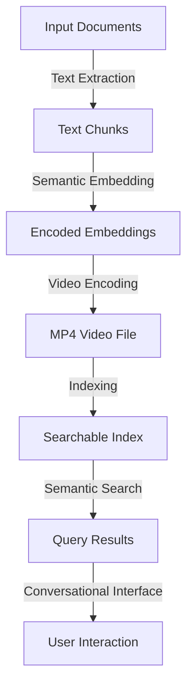

# Memvid - Video-Based AI Memory 🧠 📹

> The lightweight, game-changing solution for scalable AI memory management

Memvid redefines AI memory management by encoding text data into compact video files, enabling lightning-fast semantic search across millions of text chunks with sub-second retrieval times. Unlike traditional vector databases that require extensive RAM and storage, Memvid compresses your knowledge base into highly efficient MP4 files while ensuring instant access to any piece of information. This innovative approach delivers unmatched scalability, portability, and efficiency for AI-driven applications.

## ✨ Key Features

- 🎥 **Video-as-Database**: Store millions of text chunks in a single, portable MP4 file
- 🔍 **Semantic Search**: Retrieve relevant content using natural language queries with high accuracy
- 💬 **Conversational Interface**: Built-in chat system with context-aware responses for seamless interaction
- 📚 **PDF Integration**: Directly import and index PDF documents for instant access
- 🚀 **High-Speed Retrieval**: Achieve sub-second search performance across massive datasets
- 💾 **Storage Efficiency**: Up to 10x compression compared to traditional vector databases
- 🔌 **Pluggable LLMs**: Compatible with OpenAI, Anthropic, or local models for flexible integration
- 🌐 **Offline-First**: Fully functional offline after video generation, no internet required
- 🔧 **Simple API**: Get started with minimal code—build a knowledge base in just a few lines

## 🎯 Use Cases

- 📖 **Digital Libraries**: Index thousands of books into a single, searchable video file
- 🎓 **Educational Content**: Create searchable video memories for course materials and lectures
- 📰 **News Archives**: Compress years of articles into compact, searchable video databases
- 💼 **Corporate Knowledge**: Build company-wide, instantly accessible knowledge bases
- 🔬 **Research Papers**: Enable rapid semantic search across vast scientific literature
- 📝 **Personal Notes**: Transform personal notes into a conversational AI assistant

## 🚀 Why Memvid?

### Revolutionary Innovation

- **Video as Database**: Encodes text into MP4 files, enabling massive data storage in a compact format
- **Instant Retrieval**: Sub-second semantic search across millions of text chunks
- **10x Storage Efficiency**: Video compression drastically reduces memory and storage requirements
- **Zero Infrastructure**: No need for database servers—just portable video files
- **Offline-First Design**: Access your knowledge base anywhere, anytime, without connectivity

### Lightweight Architecture

- **Minimal Dependencies**: Core functionality in ~1000 lines of Python code
- **CPU-Optimized**: Runs efficiently without requiring GPU hardware
- **Portable**: A single video file encapsulates your entire knowledge base
- **Streamable**: Supports streaming from cloud storage for flexible deployment

## 📦 Installation

### Quick Install
```bash
pip install memvid
```

### For PDF Support
```bash
pip install memvid PyPDF2
```

### Recommended Setup (Virtual Environment)
```bash
# Create a project directory
mkdir my-memvid-project
cd my-memvid-project

# Create and activate a virtual environment
python -m venv venv
# On macOS/Linux:
source venv/bin/activate
# On Windows:
venv\Scripts\activate

# Install Memvid
pip install memvid

# Optional: Install PyPDF2 for PDF support
pip install PyPDF2
```

## 🎯 Quick Start

### Basic Usage
```python
from memvid import MemvidEncoder, MemvidChat

# Create video memory from text chunks
chunks = ["Important fact 1", "Important fact 2", "Historical event details"]
encoder = MemvidEncoder()
encoder.add_chunks(chunks)
encoder.build_video("memory.mp4", "memory_index.json")

# Start a chat session with your memory
chat = MemvidChat("memory.mp4", "memory_index.json")
chat.start_session()
response = chat.chat("What do you know about historical events?")
print(response)
```

### Building Memory from Documents
```python
from memvid import MemvidEncoder
import os

# Initialize encoder with custom chunking
encoder = MemvidEncoder(chunk_size=512, overlap=50)

# Add text files from a directory
for file in os.listdir("documents"):
    with open(f"documents/{file}", "r") as f:
        encoder.add_text(f.read(), metadata={"source": file})

# Build optimized video memory
encoder.build_video(
    "knowledge_base.mp4",
    "knowledge_index.json",
    fps=30,  # Higher FPS for more chunks per second
    frame_size=512  # Larger frames for more data per frame
)
```

### Advanced Search & Retrieval
```python
from memvid import MemvidRetriever

# Initialize retriever
retriever = MemvidRetriever("knowledge_base.mp4", "knowledge_index.json")

# Perform semantic search
results = retriever.search("machine learning algorithms", top_k=5)
for chunk, score in results:
    print(f"Score: {score:.3f} | {chunk[:100]}...")

# Retrieve context for conversational queries
context = retriever.get_context("explain neural networks", max_tokens=2000)
print(context)
```

### Interactive Chat Interface
```python
from memvid import MemvidInteractive

# Launch web-based interactive chat UI
interactive = MemvidInteractive("knowledge_base.mp4", "knowledge_index.json")
interactive.run()  # Opens at http://localhost:7860
```

### Testing with file_chat.py
Use the examples/file_chat.py script to test Memvid with your documents:
```bash
# Process a directory of documents
python examples/file_chat.py --input-dir /path/to/documents --provider google

# Process specific files
python examples/file_chat.py --files doc1.txt doc2.pdf --provider openai

# Use H.265 compression (requires Docker)
python examples/file_chat.py --input-dir docs/ --codec h265 --provider google

# Custom chunking for large documents
python examples/file_chat.py --files large.pdf --chunk-size 2048 --overlap 32 --provider google

# Load existing memory
python examples/file_chat.py --load-existing output/my_memory --provider google
```

### Complete Example: Chat with a PDF Book
```bash
# 1. Create a project directory and set up environment
mkdir book-chat-demo
cd book-chat-demo
python -m venv venv
source venv/bin/activate  # On Windows: venv\Scripts\activate

# 2. Install dependencies
pip install memvid PyPDF2

# 3. Create book_chat.py
cat > book_chat.py << 'EOF'
from memvid import MemvidEncoder, chat_with_memory
import os

# Specify your PDF file
book_pdf = "book.pdf"  # Replace with your PDF path

# Build video memory from the PDF
encoder = MemvidEncoder()
encoder.add_pdf(book_pdf)
encoder.build_video("book_memory.mp4", "book_index.json")

# Start a chat session with the book
api_key = os.getenv("OPENAI_API_KEY")  # Optional: for AI responses
chat_with_memory("book_memory.mp4", "book_index.json", api_key=api_key)
EOF

# 4. Run the script
export OPENAI_API_KEY="your-api-key"  # Optional
python book_chat.py
```

## 🛠️ Advanced Configuration

### Custom Embeddings
```python
from sentence_transformers import SentenceTransformer

# Use a custom embedding model
custom_model = SentenceTransformer('sentence-transformers/all-mpnet-base-v2')
encoder = MemvidEncoder(embedding_model=custom_model)
```

### Video Optimization
```python
# Optimize for maximum compression
encoder.build_video(
    "compressed.mp4",
    "index.json",
    fps=60,  # Higher FPS for more chunks
    frame_size=256,  # Smaller frames for better compression
    video_codec='h265',  # Advanced compression
    crf=28  # Compression quality (lower = better quality)
)
```

### Distributed Processing
```python
# Process large datasets in parallel
encoder = MemvidEncoder(n_workers=8)
encoder.add_chunks_parallel(massive_chunk_list)
```

## 🔄 Process Overview

Memvid's workflow transforms text data into a searchable video-based knowledge base through a streamlined process. Below is a detailed breakdown of how Memvid works:



1. **Text Extraction**: Memvid ingests raw text or PDF documents, extracting content into manageable chunks based on user-defined parameters (e.g., chunk size and overlap).
2. **Semantic Embedding**: Each chunk is processed using a language model to generate dense vector embeddings, capturing the semantic meaning of the text.
3. **Video Encoding**: Embeddings are encoded into video frames, leveraging video compression (e.g., H.264 or H.265) to create a compact MP4 file.
4. **Indexing**: An index file (JSON) maps video frames to text chunks, enabling rapid retrieval.
5. **Semantic Search**: Queries are embedded and matched against the index to retrieve relevant chunks with sub-second latency.
6. **User Interaction**: The conversational interface allows users to interact with the knowledge base via natural language queries, powered by integrated LLMs.

## 🐛 Troubleshooting

### Common Issues

#### ModuleNotFoundError: No module named 'memvid'
```bash
# Verify the correct Python environment
which python  # Should point to your virtual environment
# Activate the virtual environment if needed:
source venv/bin/activate  # On Windows: venv\Scripts\activate
```

#### ImportError: PyPDF2 is required for PDF support
```bash
pip install PyPDF2
```

#### LLM API Key Issues
```bash
# Set your API key (get one from your LLM provider, e.g., https://platform.openai.com)
export GOOGLE_API_KEY="AIzaSyB1-..."  # macOS/Linux
# Or on Windows:
set GOOGLE_API_KEY=AIzaSyB1-...
```

#### Large PDF Processing
```python
# Use smaller chunk sizes for large PDFs
encoder = MemvidEncoder()
encoder.add_pdf("large_book.pdf", chunk_size=400, overlap=50)
```

## 🆚 Comparison with Traditional Solutions

| Feature | Memvid | Vector DBs | Traditional DBs |
|---------|--------|------------|-----------------|
| Storage Efficiency | ⭐⭐⭐⭐⭐ | ⭐⭐ | ⭐⭐⭐ |
| Setup Complexity | Simple | Complex | Complex |
| Semantic Search | ✅ | ✅ | ❌ |
| Offline Usage | ✅ | ❌ | ✅ |
| Portability | File-based | Server-based | Server-based |
| Scalability | Millions | Millions | Billions |
| Cost | Free | $$$$ | $$$ |

## 📚 Examples

Explore the examples/ directory for practical implementations:

- Building memory from Wikipedia dumps
- Creating a personal knowledge base
- Multi-language support
- Real-time memory updates
- Integration with popular LLMs

